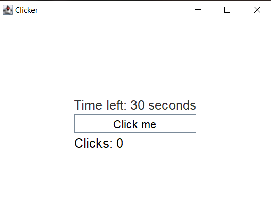
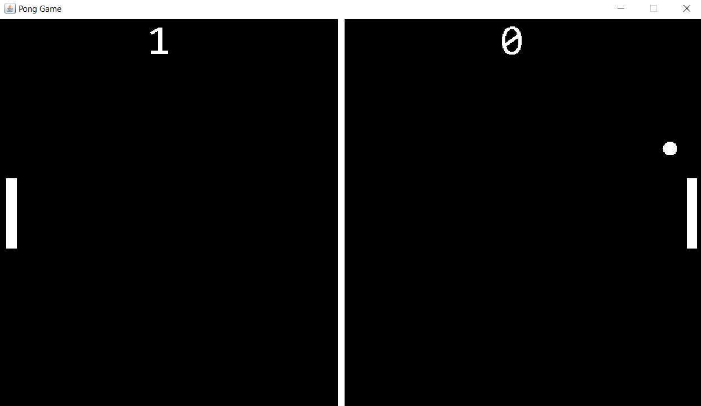
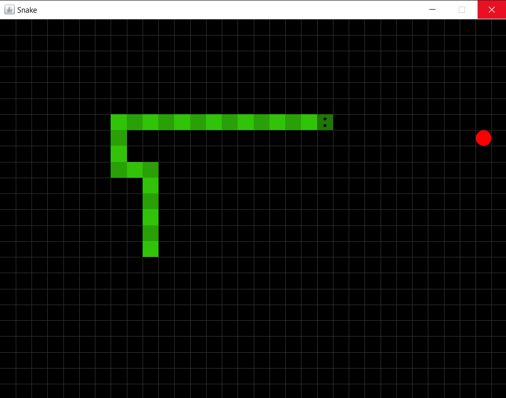

# Java-Projects
A few coding projects i made while learning java

This repository contains the following Java projects: GUI Clicker, Pong, and Snake. 

Each project has its own unique features and gameplay mechanics. Below are the details of each project:

## GUI Clicker

Clicker Game is a simple Java Swing-based game where the player has to click a button as many times as possible within a 30-second time limit. 

The game keeps track of the number of clicks made by the player and displays the final score when the time runs out.

### How to Play
- Run the application.
- Click the "Click me" button as rapidly as you can within the time limit.
- Your score (the number of clicks) is displayed on the screen.
- When the timer reaches zero, a game over message appears, showing your final score.

## Pong Game

Welcome to the Pong Game! This project is a simple implementation of the classic Pong game using Java. Pong is a two-player game where each player controls a paddle, and the objective is to score points by hitting the ball past the opponent's paddle.

### Features
- Two-player gameplay
- Realistic ball physics
- Score tracking
- Customizable game settings

### How to Play
Pong is a two-player game where each player controls a paddle. 

The objective is to score points by hitting the ball past the opponent's paddle.

### Controls
- Player 1 (Left Paddle):
    - Move Up: W key
    - Move Down: S key
- Player 2 (Right Paddle):
    - Move Up: Up Arrow key
    - Move Down: Down Arrow key
  
### Gameplay
- The game starts with the ball in the center of the screen.
- Use the paddle controls to hit the ball.
- Score points by getting the ball past your opponent's paddle.
- The first player to reach a specified number of points wins the game.

## Snake Game

The Snake Game is a classic and addictive arcade game where the player controls a snake to eat fruits and grow in size. 

The goal is to achieve the highest possible score without colliding with walls or the snake's own body.

### Features
- Intuitive and responsive controls.
- Fun and challenging gameplay for all ages.

### Launch the game application
- Use the arrow keys to control the snake's direction.

### Gameplay
- Move the snake to eat the fruit that appears on the screen.
- Each fruit eaten increases the snake's length and score.
- Avoid colliding with walls or the snake's own body, as it will end the game.
- Game Over
    -  The game ends when the snake collides with a wall or itself.
    -  The final score is displayed on the game over screen.
